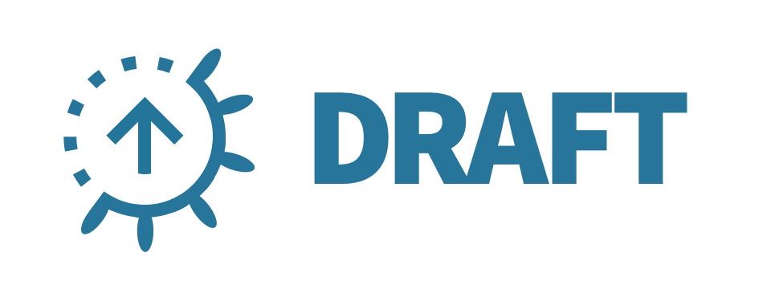

# Draft: Streamlined Kubernetes Development

[](https://ci.deis.io/job/Azure/job/draft/job/master/)

_NOTE: Draft is experimental and does not have a stable release yet._

Draft handles the heavy lifting involved in taking source code and deploying it to Kubernetes:

- Builds a container image from application source code
- Pushes the image to a registry
- Packages a [Helm][] chart from application source code
- Installs the chart to Kubernetes, deploying the application

## Usage

### Dependencies

- Draft will need a running Kubernetes cluster to deploy your app. [Minikube](https://github.com/kubernetes/minikube) is a great free option.
- Draft expects [Helm](https://github.com/kubernetes/helm) to be installed on your Kubernetes cluster. Download [`helm` v2.4.x](https://github.com/kubernetes/helm/releases) and
run the `helm init` command first, as described in [Installing Helm][].
- Draft needs to push images to a Docker registry, so you'll need to configure Draft with your Docker registry credentials. If don't already have one, you can create a Docker registry for free on either [Dockerhub.com](https://dockerhub.com) or [Quay.io](https://quay.io).

### Install Draft

Because Draft is currently experimental, there is no stable release out yet and users are expected
to be using the latest build of Draft for testing. Canary releases of the Draft client can be found
at the following links:

 - [Linux amd64](https://azuredraft.blob.core.windows.net/draft/draft-canary-linux-amd64.tar.gz)
 - [macOS amd64](https://azuredraft.blob.core.windows.net/draft/draft-canary-darwin-amd64.tar.gz)
 - [Windows amd64](https://azuredraft.blob.core.windows.net/draft/draft-canary-windows-amd64.tar.gz)

Unpack the Draft binary and add it to your PATH and you are good to go!


### Configure Draft

To configure Draft to work in your cluster, run the `draft init` command and pass in your Docker registry credentials using the `--set` flag as shown below. This command will install Draft's server side component into your cluster and let Draft communicate with a Docker registry to push and pull the container images for your application.

```
$ draft init --set registry.url=docker.io,registry.org=changeme,registry.authtoken=changeme
```

The auth token field (passed in the command above as the value for `registry.authtoken`) follows the format of Docker's X-Registry-Auth header.

To generate the auth token field for **credential-based logins** such as Docker Hub and Quay, use:

```
$ echo '{"username":"jdoe","password":"secret","email":"jdoe@acme.com"}' | base64
```

For **token-based logins** such as Google Container Registry and Amazon ECR, use:

```
$ echo '{"registrytoken":"9cbaf023786cd7"}' | base64
```

### Take Draft for a Spin

Climb aboard and explore the [Getting Started Guide][Getting Started] - you'll soon be sailing!

## Contributing

If you're looking to build from source or get started hacking on Draft, please see the
[hacking guide][hacking] for more information.

This project has adopted the [Microsoft Open Source Code of Conduct](https://opensource.microsoft.com/codeofconduct/). For more information see the [Code of Conduct FAQ](https://opensource.microsoft.com/codeofconduct/faq/) or contact [opencode@microsoft.com](mailto:opencode@microsoft.com) with any additional questions or comments.

## License

This software is covered under the MIT license. You can read the license [here][license].

This software contains code from Heroku Buildpacks, which are also covered by the MIT license.

This software contains code from [Helm][], which is covered by the Apache v2.0 license.

You can read third-party software licenses [here][Third-Party Licenses].


[Getting Started]: docs/getting-started.md
[hacking]: docs/contributing/hacking.md
[`helm` v2.4.2]: https://github.com/kubernetes/helm/releases/tag/v2.4.2
[Helm]: https://github.com/kubernetes/helm
[Installing Helm]: https://github.com/kubernetes/helm/blob/master/docs/install.md
[Kubernetes]: https://kubernetes.io/
[license]: LICENSE
[Third-Party Licenses]: NOTICE
